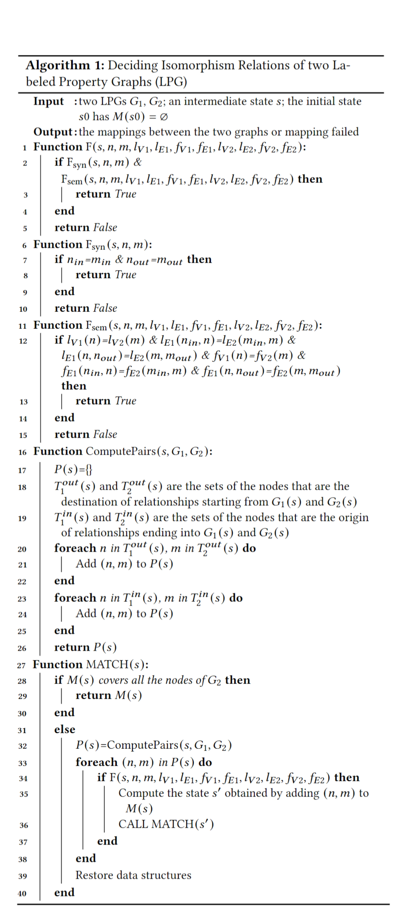

<<<<<<< HEAD
# GraspDB

We propose GraspDB, to the best of our knowledge the first black-box approach for testing update engines of graph database.

# Getting Started

Requirements:
* Java 11
* [Maven](https://maven.apache.org/)
* The graph database engines that you want to test (now supporting Neo4j, RedisGraph, Memgraph and Agensgraph)


# Project Structure

* src
    * main/java/org.example.GraspDB
        * common:  infrastructure
        * CypherTransform:  the mutator for GraspDB to generate mutated query
        * parsercypher: the cypher parser generated by ANTLR
        * cypher
          * ast/standard_ast: implementation of ast structure
          * algorithm: algorithm used by GraspDB
          * gen: generators for queries, graphs, patterns, expressions
            * condition
              * GuidedConditionGenerator.java: the condition generator for GraspDB
            * graph
              * SlidingGraphGenerator.java: the graph generator for GraspDB
            * expr
              * RandomExpressionGenerator.java: the expression generator for GraspDB
          * oracle: oracles
            * DifferentialNonEmptyBranchOracle.java: the differential oracle used by GraspDB
        * support for different databases[neo4j, redisGraph, memgraph, agensmgraph, ...]
* out: the executable jar file GraspDB.jar


# Quick Start
In this section we are going to do metamorphosis testing on Neo4j.
Note that for the database tested, we must create two instances of it for testing because our test case pairs can change the database data. Run the docker images of Neo4j:

```shell
docker run --restart always --name neo4j_1 -p 7473:7473 -p 7474:7474 -p 7687:7687 -d neo4j:5.6.0
docker run --restart always --name neo4j_2 -p 7475:7473 -p 7476:7474 -p 7688:7687 -d neo4j:5.6.0
```

Create the file config.json and paste the following content:
```json
{
  "neo4j@first": {
    "port": 7687,
    "host": "localhost",
    "username": "neo4j",
    "password": "GraspDB"
  },
  "neo4j@second":{
    "port": 7688,
    "host": "localhost",
    "username": "neo4j",
    "password": "GraspDB"
  }
}
```
Then run the following command:
```shell
java -jar GraspDB.jar --num-tries 1000 -num-queries 50 --database-type neo4j composite
```
The testing should begin, GraspDB will generate 1000 graphs and for each graph it will generate 50 queries.
All the graph data and test case pairs will be recorded in ```logs``` directory. And the bug reports are recorded in ```GraspDB/log.txt```.


# Using GraspDB

Generally GraspDB can be configured and executed using the following command:

```bash
java -jar GraspDB.jar --[database_option1] --[database_option2] composite
```

Here are some examples of database options(relation-removed and graph-state-oracle options are used for Table 6 in our paper):

```
--num-tries <num-tries> // the number of graphs to generate
--num-queries <num-queries> // the number of queries generated for each graph
--database-type <databaseType> // the type of database tested
--relation-removed <mutation rule> // which type of mutation rule to be removed, 1 for AWC, 2 for MWC, 3 for MRC, 0 for none
--graph-state-oracle <check or not> // whether check the graph state as oracle, 0 for true, 1 for false
```

For example, if you want to test Memgraph, the configuraion for both database instances is specified in the ```config.json``` file:
```json
{
  "memgraph@first":{
    "port": 7689,
    "host": "localhost",
    "username": "memgraph",
    "password": "GraspDB"
  },
  "memgraph@second":{
    "port": 7690,
    "host": "localhost",
    "username": "memgraph",
    "password": "GraspDB"
  }
}
```
and you can use the following command(similar commands are used for Table 7 in our paper):

```bash
java -jar GraspDB.jar --num-tries 50000 --num-queries 100 --database-type memgraph composite
```

GraspDB identify the name of the database by the key in the json file before the "@" character. For example "memgraph@first" tells memgraph to connect to a database using the Memgraph driver. So you can add multiple databases of the same database and name them freely as long as the database name before "@" is corresponded with the actual database:
```json
{
  "neo4j@latest": {
    "port": 7687,
    "host": "localhost",
    "username": "neo4j",
    "password": "GraspDB"
  },
  "neo4j@optimization": {
    "port": 10101,
    "host": "localhost",
    "username": "neo4j",
    "password": "GraspDB"
  },
  "redisgraph@2.8.17": {
    "port": 6379,
    "host": "localhost",
    "username": "neo4j",
    "password": "GraspDB",
    "restart-command": "docker run -d -e REDISGRAPH_ARGS=\"TIMEOUT=1000\" -p 6379:6379 -it --rm redislabs/redisgraph:2.8.20"
  }
}
```

Notice that GraspDB will not automatically create database user, as a result, you might need to manually create a user and grant it with the privilege for remote connection, executing queries, writing to databases and creating/deleting new databases.

Here are the set of databases supported by GraspDB:

```
neo4j
redisgraph
memgraph
agensgraph
```

# Graph State Oracle and Graph Isomorphism Algorithm

We compare graph state as a new oracle to detect writing-related logic bugs and we apply a simplified version of the algorithm VF2 to check if two labeled property graphs are the same. And here's our algorithm:



# Bugs Found by GraspDB

The following table shows the number of bugs detected by GraspDB.

| Subject    | Detected  | Writing-related | Fixed | Confirmed but not fixed | Reported but not confirmed |Crash/Error |Logic |
| ---------- | --------- | ----------------| ----- | ----------------------- | -------------------------- |------------|------|
| Neo4j      | 35        | 18              | 30    | 3                       | 2                          | 29         |4     |
| RedisGraph | 15        | 6               | 6     | 6                       | 3                          | 8          |4     |
| MemGraph   | 17        | 7               | 7     | 6                       | 4                          | 8          |5     |
| AgensGraph | 10        | 0               | 0     | 0                       | 10                         | 0          |0     |
| SUM        | 77        | 31              | 43    | 15                      | 19                         | 45         |13    |


>>>>>>>>>

